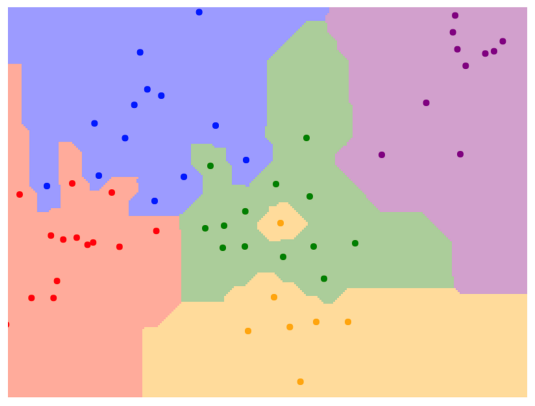
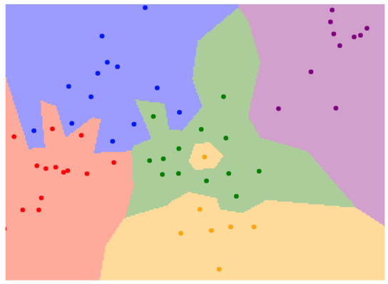
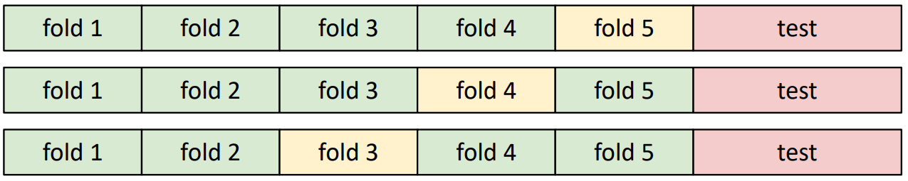
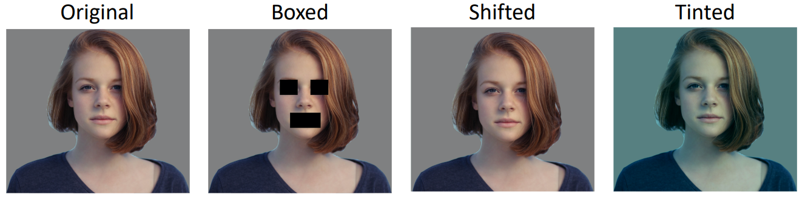

# Image Classification 

## Challenges : Semantic Gap 

#### 1. Viewpoint Variation 
예를 들어 고양이를 관측한 위치(viewpoint variation)에 따라 컴퓨터에게 고양이는 상당히 다르게 인식된다.  

#### 2. Intraclass Variation 
예를 들어 고양이의 종류(intraclass variation)에 따라 다르게 인식될 수 있다. 고양이의 종류가 다르더라도 cat이라고 구분해 낼 수 있어야 한다. cat이라는 형태는 같지만 pixel value는 모두 다르기 때문이다. 

#### 3. Fine-Grained Categories 
예를 들어 같은 고양이 내에서 품종을 구분하고 싶을 때 Fine-grained Classification이 사용되는데 we might want to recognize different categories that appear very visually similar. 예를 들어 고양이 내에서도 종을 구분한다. 

#### 4. Background Clutter 
배경 때문에 구분이 쉽지 않을 때 인식에 어려움이 있다. 

#### 5. Illumination Changes 
Different lighting condition에 따라 인식에 차이가 발생한다.

#### 6. Deformation 
물체는 같지만 Different position에서 관찰한 경우 구분이 쉽지 않다. 

#### 7. Occlusion
예를 들어 담요에 덮인 고양이, 풀에 가려진 고양이 같은 경우에 구분이 쉽지 않다.  

---
## Buildig Block for other tasks

#### Ex1) Object Detection 
Perfrom하는 방법 중 하나 : 서로 다른 Sliding Window를 통해서 classify differnt sub-regions of the image. 

#### Ex2) Image Captioning 
given an input image we might want to write a natural language sentence to describe what is in the image.

#### Ex3) Playing Go
Playing Go 또한 classification problem이다. 
Input : An image where the pic each pixel of the image describes the state of the game board at some position 
Output : Classification Problem avout whic position on the board should I place my next stone. 

---
## Data-Driven Approach 
데이터 기반 방법은 사람이 직접 알고리즘을 만드는 것이 아니라 데이터를 기반으로 모델을 만들어 문제를 해결하고자 하는 방법이다. 
1. Collect a dataset of images and labels
2. Use Machine Learning Algorithm to train classifier
3. Evaluate the classifier on new images 
 

 

* API
    * Train
        '''Python
        def train(images, labels):
            #machine learning : 
            return moodel 
        ''' 
    * Predict 
        '''Python
        def predict(model, test_images):
            #use model to predict labels
            return test_labels
       ''' 

---
## Image Classification Dataset
 

* MNIST
    * handwritten digit
    * "Drosophila of computer vision"
    * 매우 흔하고 단순. 
    * Quick to try new idea

  

* CIFAR10
 
    * 10 classes
    * 50k training images 
    * 10k testing images
    * 32x32 RGB images

 

* CIFAR100
 
    * 100 classes
    * 50k training images 
    * 10k testing images
    * 32x32 RGB images  
    * 20 superclasses with 5 classes each 

 

* ImageNet
 
    * 1000 classes
    * 1.3M training images
    * 50k validadtion images
    * 100K test images (100 per class)
    * Performance metric : Top 5 accuracy. 5 prediction 중에 하나라도 맞는 게 있으면 correct prediction이라고 간주. 이미지에서 보통 1개의 object만 존재하는 경우는 거의 없기 때문에. 
    * images have variable size, often resize to 256x256

 

* MIT Places
 
    * 장소에 관한 image 
    * 365 classes of different scene types
    * ~8M training images
    * 18.25K val images (50 per class)
    * 328.5K test images (900 per class)
    * images have variable size, often resize to 256x256

 

* Omniglot
 
    * 상대적으로 적은 데이터로 학습시킴. Few shot classification preblem이라고 함
    * 각각의 카테고리는 어떠한 언어임.
    * 1623 categories
    * 20 images per category
 
 
---

## First Classifier : Nearest Neighbor 

### Distance Metric 
1. L1 distance (Manhattan distance)
    $$
    d_1(I_1,I_2)=\sum_p \left | I_1^p-I_2^p \right |
    $$
    * 그래프에서 경계가 vertical,horizontal, 45도 정도의 기울기를 갖는line으로 이루어져 있다.
    
    
2. L2 distance (Euclidean distance)
    $$
    d_2(I_1,I_2) = \sqrt{\sum_{p}^{}(I_1^p-I_2^p)^2}
    $$
    * line이 다양한 방향으로 기울어져 있는 걸 알 수 있다.
    

- L1 L2 distance의 차이 : 
 
L1이 아닌 L2 distance를 쓴다는 것은 여러개의 dimension에서 적당한 차이를 보이는 것보다 하나의 dimension에서 큰 차이를 보이는 것에 더 패널티를 많이 준다는 의미를 갖고 있다. 

### Nearest Neighbor Classifier 
    '''python
    import numpy as np
    
    class NearestNeighbor:
        def __init__(self):
            pass
        
        def train(self,X,y):
            """ X is N x D where each row is an example. Y is 1-dimension of size N """
            self.Xtr = X
            self.ytr = y 
        
        def predict(self,X):
            """ X is N X D where each row is an example we wish to predict label for """ 
            num_test = X.shape[0]
            # lets make sure that the output type matches the input type 
            Ypred = np.zeros(num_test, dtpye = self.ytr.dtpye)
            
            # loop over all test rows 
            for i in xrange(num_test):
                # find the nearest training image to the i'th test image
                # using the L1 distance (sum of absolute value difference)
                distances = np.sum(np.abs(self.Xtr - X[i,:]),axis =1 )
                min_index = np.argmin(distances) # get the index with smallest distance
                Ypred[i] = self.ytr[min_index]
            
            return Ypred 
    ''' 

### 시간복잡도
* Training : O(1)
* Testing : O(N) (N example이 있을 때) linear time 
* Bad 한 이유 : slow training은 참아도 slow testing은 못참음. testing은 빨라야됨. 
* 계산 복잡성 줄이기 위한 연구 
 
ANN(Approximate Nearest Neighbor). ANN을 구현한 FLANN이라는 것도 있고, 페이스북이 오픈소스에 공개한 유사한 ANN의 변종 Faiss 등도 있다. 

### K-nearest neighbor 
NN은 단점이 많은 알고리즘이다. NN은 단 하나의 label만 prediction에서 고려하기 때문에 안정성이 떨어지는 결과를 보여준다. 한마디로 성능이 떨어지는데 이를 보완하기 위해 k-nearest neighbor(KNN)를 활용할 수 있다. 이 방법은 테스트 단계에서 인풋과 가까운 순으로 총 k개의 데이터의 레이블을 구한 후, 가장 빈번하게 나오는 레이블로 예측하는 방법이다. 이렇게 여러개로부터 가장 빈번하게 나오는 것을 예측 결과로 한다. 

### Decision Boundary의 noise를 줄일 수 있는 방법 
* Use more neighbor : k=1보다 k=3일 때가 경계가 더 smooth. 

### Hyperparameters Tuning 
* Idea 1 : Choose hyperparamters that work best on the data (k=1)

* Idea 2 : Split data into train and test, choose hyperparameters that work best on test data 

* Idea 3 : Split data into train, val, and test ; choose hyperparameters on val and evaluate on test. Hyperparameter를 찾는 데 테스트 셋을 사용할 수 없다. 만약 test set으로 hyperparameter tuning을 하게 되면 모델이 테스트셋에 과적합(overfitting)되며, 다른 처음보는 데이터에 적용했을 때 상당히 성능이 떨어진다. 따라서 테스트 셋은 반드시 모델 구축이 끝난 후, 단 한 번 평가되어야 한다. Hyperparameter tuning을 위해 validation set을 활용한다. 

* Idea 4 : Cross-Validation : Split data into folds, try each fold as validation and average the results. Useful for small datasets, but not used too frequently in deep learning. 

### Problem : Curse of Dimensionality 
- 차원이 높아질수록 데이터 사이의 거리가 멀어지고, 빈공간이 증가하는 공간의 성김 현상 (Sparsity) 

### Raw-pixel을 이용한 모델은 왜 많이 사용되지 않는 가? 

위의 그림에서 original과 shifted를 비교했을 때, 피사체의 위치에 차이만 있을 뿐 물체에는 차이가 없다. 하지만 단지 물체가 옆으로 이동하는 것만으로도 상당한 distance가 생긴다. 따라서 Image classification에서는 pixel value가 아닌 feature vector 사용하는 것이 효과적이다.  

### Nearest Neighbor with ConvNet feature 
ex) Image Captioning with Nearest Neighbor 

    

