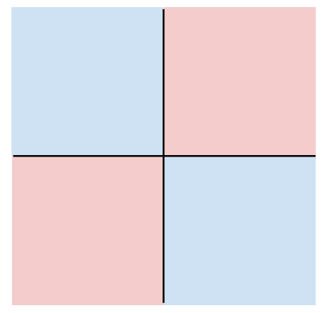

## Linear Classifier
Linear Classifier는 단순한 구조이지만 Neural Network를 이루는 중요한 요소이다. 

### Parametric Appproach 
Linear Classifier에서는 Input image x와 learnable parameter W가 사용된다. 
#### 1) Algebraic Viewpoint 
* f(x,W) = Wx+b
* 이 함수의 output은 구분하고 싶은 category의 수 만큼의 class score이다. 
* input image x는 column 형태로 stretch된다. 예를들어 2x2 형태의 이미지라면 4개의 열을 가진 column으로 stretch 된다. 

#####  Bias Trick 
Bias Trick은 Linear Classifier를 Algebraic Viewpoint로 바라봤을 때 얻는 이점이다. 

Weight에 bias에 해당하는 열을 추가해주고, input image vector 가장 마지막 열에 1을 추가해 확장해준다. 이런 방식으로 연산할 경우 Wx+b의 연산과 같은 계산 결과 값을 도출한다. 

##### Predictions are Linear
Linear Classifier를 Algebraic Viewpoint로 바라봤을 때 얻는 또 다른 이점은 결과가 Linear하다는 것이다. 

위의 그림에서 알 수 있듯이 image를 c배 해주면 결과값인 Prediction도 c배가 된다. 

#### 2) Visual Viewpoint 

Algebraic Viewpoint는 input image를 column vector 형태로 strech해 주어야 했다. 그러나 Visual Viewpoint에서는 weight의 각 행을 input image와 같은 shape으로 변환한 matrix를 구성해서 input image와 내적해준 후 bias를 더해준다. Visual Viewpoint를 Template matching이라 하기도 한다. 왜냐하면 classifier가 weight를 학습하는 것을 category마다 하나의 이미지 템플릿을 학습한다고 볼 수 있기 때문이다. 

##### Mode Splitting 
Linear Classifier는 카테고리 당 하나의 템플릿만 학습하는데 single template은 데이터의 multiple modes를 탐지할 수 없다는 특징이 있다. 따라서 single template으로 가능한 많은 appearance를 cover하기 위해서 horse 그림의 경우 왼쪽과 오른쪽 모두 머리가 있는 것 처럼 표핸했다. 

#### 3) Geometric Viewpoint 
이미지를 고차원 공간의 한 점으로 보는 관점이다. 

class 마다 hyperplane이 있고 각각의 hyperplane이 고차원의 Euclidean space를 cutting out 한다. Geometric Viewpoint는 linear classifier를 이해하는 데 유용한 방법이지만 주의해야 할 것은 geometry는 high dimension일 때 직관적이지 못하다는 단점이 있다. 

#### Hard Cases for a Linear Classifier 
* Case 1
 

 
1사분면과 3사분면의 class가 동일하고, 2사분면과 4사분면의 class가 동일하다. 이러한 상황에서 single hyperplane으로 class를 구분하는 것은 불가능하다. 

* Case 2
 

 
마찬가지로 한개의 hyperplane으로 class를 구분할 수 없다. 

* Case 3
 

 
마찬가지로 한개의 hyperplane으로 class를 구분할 수 없다. 

역사적인 관점에서 보면 Perceptron은 XOR를 학습하지 못했다. Perceptron은 linear classifier의 일종인데, XOR를 학습하지 못하는 이유는 Linear Classifier의 Geometric Viewpoint 때문일 것이다. 

### To Do 
1. Use a loss function to quantify how good a value W is 
2. Find a W that minimizes the loss function (optimization)

 

#### > Loss Function 
Loss function은 objective function이라고도 하고 cost function이라고도 한다. Loss function은 classifier의 성능을 나타낸다. 따라서 loss가 적으면 good classifier이고 loss가 높으면 bad classifier이다. Negative loss function은 loss를 최대화하는데 reward function, profit function, utility function, fitness function등으로 불리기도 한다. 
 
* Dataset :  
$$
\left\{(x_i,y_i) \right\}_{i=1}^{N} 
$$
 

x_i는 image이고 y_i는 label이다. 

* Loss Function 수식 :  
$$
L = \frac{1}{N}\sum_{i}^{} L_i(f(x_i,W),y_i)
$$
 
Loss function은 prediction이 true label과 다른 경우를 측정한다. 

* 예시 1) Multiclass SVM Loss 
 
 
SVM Loss에서는 correct class의 score과 다른 class들에서 나온 가장 높은 score의 차이가 Margin보다 클 때는 값이 0이다. 이러한 loss를 "Hinge Loss" 라고도 부른다. 
 
$$
L_i = \sum_{j\neq y_i}max(0,s_j-s_{y_i}+1)
$$ 
 

위의 수식을 설명하자면 만약 correct class의 score이 incorrect class의 score 보다 1이상 크다면 max 안에 있는 수식의 값이 음수가 되어 max함수를 통해 0 이 도출된다. 

* 에시 2) Cross-Entroy Loss (Multinomial Logistic Regression)
    *  raw classifier score를 확률로 해석하기 위해 사용된다.
    * raw classifier score에서 확률을 구하는 과정 
        * Softmax function 
        
        softmax 함수를 이용해 확률의 합이 1이 되도록 만든다. 
        * 계산된 확률과 기대 확률의 비교를 Kullback-Leibler divergence라는 것을 통해 한다. 
        
    * Cross-Entropy의 특징 
        * What is the min/max possible Loss Li? 
        : Min Loss는 0. Max Loss는 +infinity 이다. 하지만 여기서 Min Loss 0은 실질적으로는 도달할 수 없다. 이론적으로만 가능하다. 왜냐하면 softmax함수를 썼기때문이다.   
        * 모든 score이 가우시안 분포를 따르는 random value일 때 loss는 무엇인가 ? 
        : log(C)이다. 왜냐하면 계산된 확률이 uniform 분포를 따른것이다. 따라서 각 클래스마다 확률이 1/C가 되고 Loss를 계산해보면 log(C)이다. 

#### > Regularization 
Regularization은 objective function에 더해지는 어떠한 piece이다.Regularization은 모델이 training data에 대해 과적합하는 것을 막아준다. 
 
$$
L = \frac{1}{N}\sum_{i}^{} L_i(f(x_i,W),y_i) + \lambda R(W)
$$
 

* Simple examples
    * L2 regularization
     
    $$
    R(W) = \sum_k \sum_l W_{k,l}^2 
    $$
    * L1 regularization 
     
    $$
    R(W) = \sum_k \sum_l \left | W_{k,l}\right |
    $$
    * Elastic net(L1+L2) 
     
    $$
    R(W) = \sum_k \sum_l \beta W_{k,l}^2 + \left | W_{k,l}\right | 
    $$
     

* More complex (Neural Network model에서 사용)
    * Dropout
    * Batch normalization
    * Cutout, Mixup, Stochasitc depth, etc.. 

* Reqularization의 목적 
    * Expressing Preferences : Feature들에 대한 선호도를 나타내기 위해 사용된다. 
        * L1 regularization : weight가 하나의 feature에 집중된다. 
        * L2 regularization : weight가 모든 feature들에 대해 동등하게 적용된다. 
    * Prefer Simple Models : overfitting을 피하기 위해 gerneralize 잘되는 simple한 모델을 선호한다.
        
    * 곡률을 추가함으로써 optimization을 향상한다. 

