# Optimization 

## Gradient

### Numeric Gradient

current w에 h라는 변화를 줬을 때 loss의 차이를 변화량으로 나눠서 gradient를 구한다. 그렇게 second dimension, third dimention ... 들에 대해서 gradient를 계산한다. 이러한 방식을 Numeric Gradient라고 한다. 그러나 문제는 굉장히 slow하다는 것이다. larger neural network에서는 weight 매트릭스가 굉장히 크다. 이럴 경우 gradient를 계산하는데 numeric Gradient는 적절하지 않다. 또한 이렇게 계산된 gradient는 approximate하다는 특징을 갖고 있다. 도함수에서 h는 직짜 극한이 아니라 임의의 작은 값을 사용하므로 완전히 정확한 값을 구한다고도 할 수 없다. 

### Analytic Gradient 

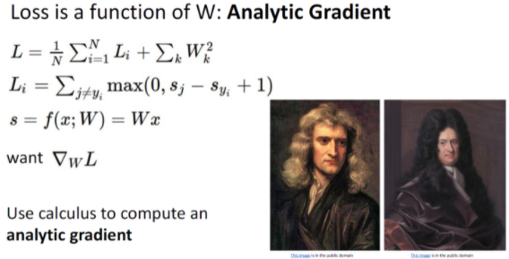

앞선 Numeric Gradient 방법 대신 Inpractice에서는 Analytic Gradient 방법을 이용한다.대신 실제 모델에 적용하기 전에 구현numeric gradient를 사용해서 제대로 구현되었는지 확인한다. 이것을 Gradient check라고 한다. 

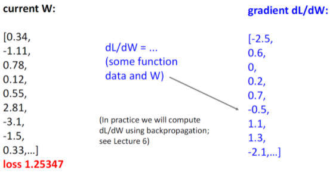

gradient는 dL/dW이다. 이는 back propagation할 때 사용이 되는데 구체적인 것은 lecture 6에서 언급한다. 

### How to Compute Gradient

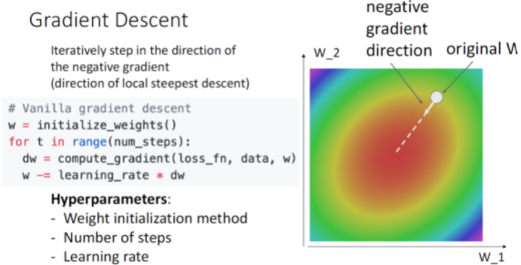

gradient descent는 반복적으로 negative gradient direction으로 움직이는데 위의 코드에서 알 수 있듯 먼저 weight를 initialize해주고 num_steps만큼 반복문을 돌려서 gradient를 계산해주고 계산된 dw를 learning rate에 곱해서 weight에 빼준다.

따라서 이러한 과정에서 사용된 hyperparameter는 다음과 같다. 

* Weight Initialization method
* Number of steps
* Learning rate

## Gradient Descent 

### Batch Gradient Descent (Full Batch Gradien Descent)

Loss function은 training data set의 giant sum이다. 따라서 graident 또한 indivisual training set의 gradient의 합이다. 근데 문제는 데이터 셋이 커지면 sum이 매우 expensive해진다는 것이다. 

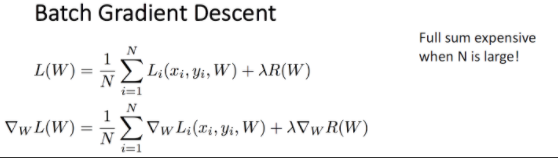

그래서 이를 약간 변형해서 사용한다고 한다. 

### Stochastic Gradient Descent (SGD) 

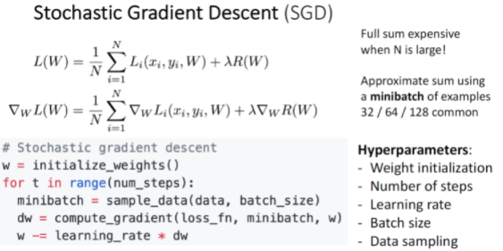

이 방법은 모든 데이터에 대해 Gradient와 Loss를 구하기 보다 표본 데이터를 추출해서 일부만을 가지고 구하는 방법이다. 여기서 표본을 minibatch라고 하며 일반적으로 32/64/128과 같은 2의 n승을 사용한다. 그래서 코드를 보면 minibatch = sample_data(data, batch_size) 하는 코드가 추가가 됐다. Hyperparameter도 추가됐는데 이는 Batch size, Data sampling이다. 

Batch size의 경우 컴퓨터의 GPU가 허용하는 한, 최대한 크게 잡는 것이 좋으며, Data sampling은 training data를 sampling하는 것으로 Image Classification에서 그다지 중요한 hyperparameter가아니다. 

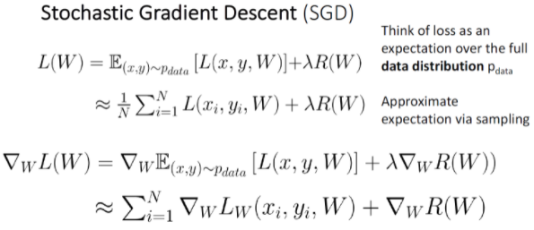

SGD에서는 표본 data를 가지고 Gradient와 Loss를 구하기때문에 표본 데이터의 분포가 전체 데이터의 분포와 최대한 유사하도록 표본을 선정해야 한다. Monte carlo method로 반복된 무작위 추출을 이용하여 함수의 값을 수리적으로 근사한다. 

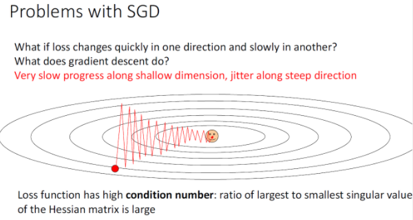

SGD는 아쉽게도 몇몇 문제가 있는데 Gradient Descent가 지그재그를 그리면서 진행되기 때문에 더 많은 step이 소요된다는 것이다. 이때문에 SGD는 Full Batch보다 Overshoot문제에도 더 취약하다.  여기에는 Trade off가 있는데 zigzagging을 피하기 위해서 step사이즈를 아주 작게 하면 overshoot zigzagging 패턴을 피할 수는 있지만 converge가 매우 느리게 된다. 

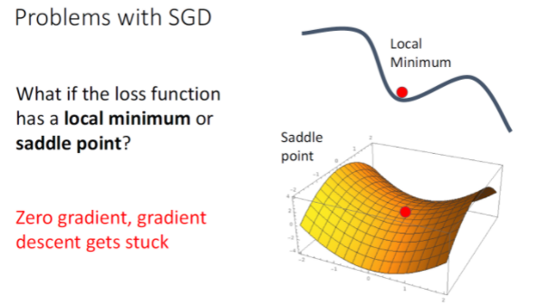

또다른 문제는 Local Minimum에 빠질 위험이 높다는 것이다. local minimum이란 zero gradient이지만 function의 bottom은 아닌 포인트이다. 고차원의 데이터에서는 graident가 0인 saddle point에 위치해서 학습이 크게 지연될 수 있다.

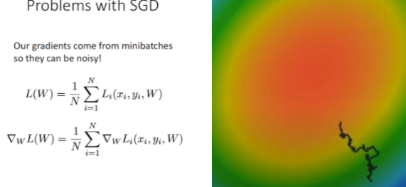

그리고 SGD 는 일부 데이터로만 학습을 진행하기에 Loss Function에서의 W의 궤적이 항상 Loss의 기울기를 따르는 것이 아니라 거꾸로 돌아가기도 하는 등의 노이즈가 끼는 경우가 많다.

#### SGD+Momentum 

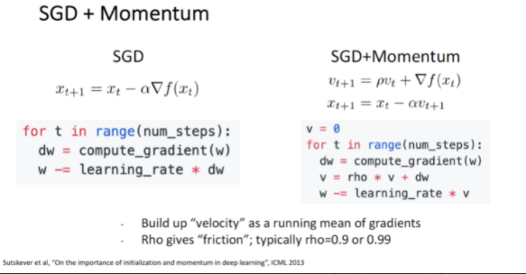

그래서 살짝 변형해서 사용하는데 그것은 SGD + momentum방법이다. 그림 오른쪽의 SGD+Momentum을 보면 velocity vector가 추가된다. 그리고 hyperparameter rho는 friction 혹은 decay rate라고 할 수 있다.

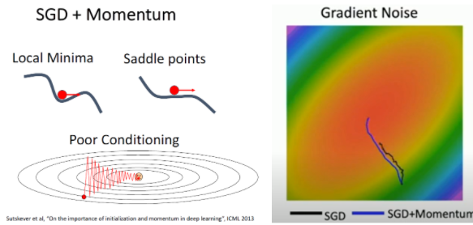

SGD+Momentum의 경우 관성에 의해서 Local Minimum이나 Saddle point를 만나더라도 SGD보다 쉽게 빠져나올 수 있다. 또한 지그재그로 움직이는 Poor Conditioning도 완화해줄 수 있다. 

#### Nesterov Momentum

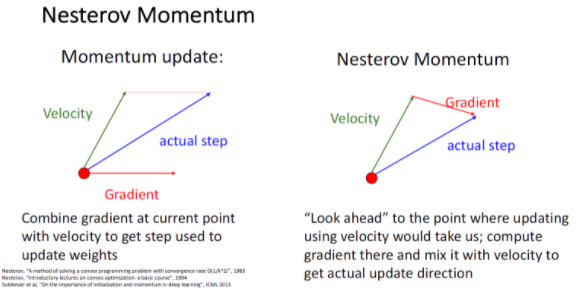

Momentum update같은 경우는 지난 step의 정보를 반영한 추세 velocity와 gradient가 합쳐져서 다음 actual step이 정해진다.

반면에 Nesterov Momentum같은 경우는 현재의 위치에서 velocity만큼 이동했을 때의 gradient를 이용해 step를 정한다. 

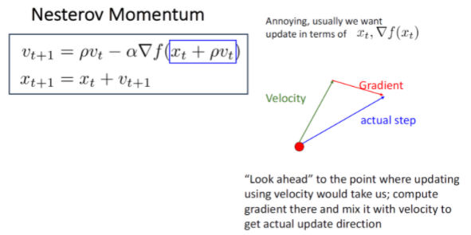

look ahead vector는 $x_t + \rho$이다. 그래서 새로 업데이트 되는 velocity는 이전의 velocity - look ahead vector이다. 그러나 이 방식으로는 api등을 이용하기는 쉽지 않다. 

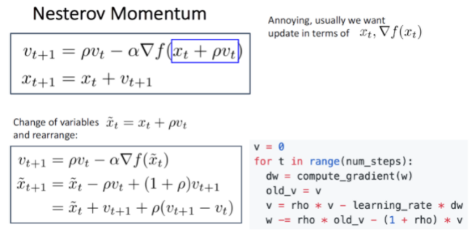

그래서 이런식으로 살짝 변형해서 적용한다. 

### AdaGrad

SGD의 변형으로 SGD+Momentum 말고도 adaptive learning rate를 활용한 AdaGrad라는 방법도 있다. 

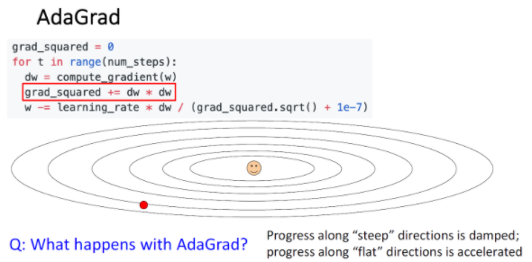

Adagrad에서는 gradient가 클 경우, 큰 값으로 나누기에 step size가 작아지고, gradient가 작을 경우에는 작은 값으로 나누기에 step size가 커진다. 그래서 gradient descent의 진행이 지그재그를 이루는 Poor conditioning을 완화시킬 수 있다. 하지만 AdaGrad는 step이 많이 진행될수록 grad_squared가 커져서 (왜냐면 이전값에 계속 더해주기 떄문에)gradient descent가 멈춰버릴 가능성이 있다.

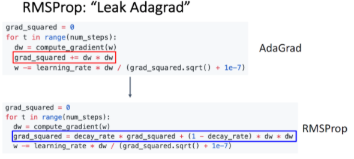

그래서 AdaGrad를 개선한 것이 RMSProp이다. 이것은 velocity를 decaying 시킨다. 이 것은 grad_squared를 decay 시킨다. 이것을 더함으로써 slow down 되지 않도록 도울 수 있다. 

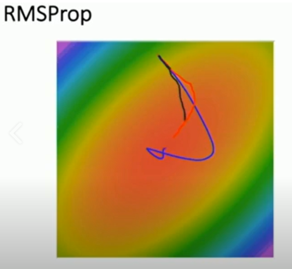

이 그림에서 RMSProp는 빨간 선인데 RMSProp는 step size가 점점 줄어들기 때문에 SGD+Momentum에 비해 overshoot이 덜하다. 

### Adam (almost) : RMSProp + Momentum

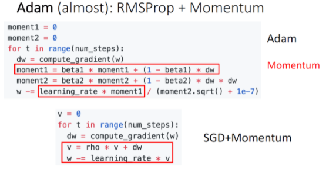

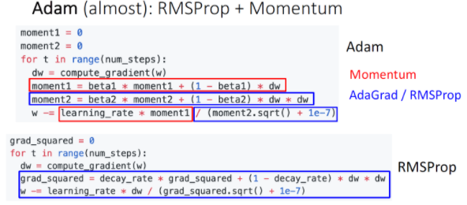

Adam 방법은 SGD+Momentum과 RMSProp의 장점을 합친것이다.

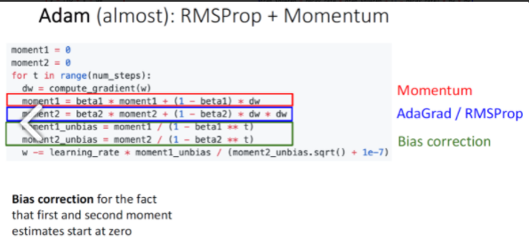

Adam 방법에서 beta1과 beta2가 있는데 beta2가 1에 가까울 경우(Assume beta2 = 0.999) t=0에서 step size가 매우매우 커지기에 bias correction을 추가한 형태로 사용한다. 

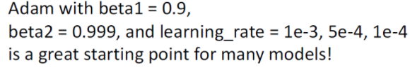

강의에는 beta1=0.9, beta2=0.999, learning rate는 1e-3,5e-4, 1e-4를 추천한다.
